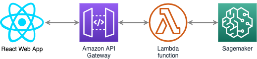

# Sentiment Analysis Deployment on Sagemaker

This project is going to show how to develop a sentiment analysis model from preprocessing, training, and serving. The main entry of this project is via the accompanying [notebook file](./SageMaker%20Project.ipynb). This file shows the detail of each step needed to build the model, up to serving via web app. The sentiment analysis model is Recurrent Neural Network trained on [IMDB dataset](http://ai.stanford.edu/~amaas/data/sentiment/).

## Technologies



Public access to this sentiment analysis model is going to be via simple web app built on React.js which invokes HTTP request to API Gateway. This API Gateway is going to parse the HTTP request body and pass it to a lambda function that in turn will forward it to a deployed Sagemaker model. Lambda function is the main interface for the sagemaker real-time inference model that we have developed and deployed.

### AWS Stack
- [API Gateway](https://reactjs.org/) - Gateway to world wide web
- [Lambda](https://www.styled-components.com/) - Serverless function invocation
- [Sagemaker](https://redux.js.org/) - ML training & serving platform

### ML Stack
- [PyTorch](https://pytorch.org/) - Deeplearning framework
- [Numpy](https://numpy.org/) - Multidimensional array operations
- [NLTK](https://www.nltk.org/) - Natural language toolkit

## Setup

The notebooks provided in this repository are intended to be executed using Amazon's SageMaker platform. The following is a brief set of instructions on setting up a managed notebook instance using SageMaker, from which the notebooks can be completed and run.

### Log in to the AWS console and create a notebook instance

Log in to the AWS console and go to the SageMaker dashboard. Click on 'Create notebook instance'. The notebook name can be anything and using ml.t2.medium is a good idea as it is covered under the free tier. For the role, creating a new role works fine. Using the default options is also okay. Important to note that you need the notebook instance to have access to S3 resources, which it does by default. In particular, any S3 bucket or objectt with sagemaker in the name is available to the notebook.

### Use git to clone the repository into the notebook instance

Once the instance has been started and is accessible, click on 'open' to get the Jupyter notebook main page. We will begin by cloning the SageMaker Deployment github repository into the notebook instance. Note that we want to make sure to clone this into the appropriate directory so that the data will be preserved between sessions.

Click on the 'new' dropdown menu and select 'terminal'. By default, the working directory of the terminal instance is the home directory, however, the Jupyter notebook hub's root directory is under 'SageMaker'. Enter the appropriate directory and clone the repository as follows.

```bash
cd SageMaker
git clone https://github.com/i-ahsanujunda/sentiment-analysis-sagemaker-pytorch
exit
```

After you have finished, close the terminal window.
